# Neural Style Transfer 

This is a PyTorch implementation of neural style transfer based on the paper [A Neural Algorithm of Artistic Style](https://arxiv.org/pdf/1508.06576) by Gatys et al. 
The aim is to transfer the artistic style of one image onto the content of another using a deep CNN (in this case a pre-trained VGG19 network).

Here is an example of the Taj Mahal mixed with The Starry Night by Vincent van Gogh:

    
    
    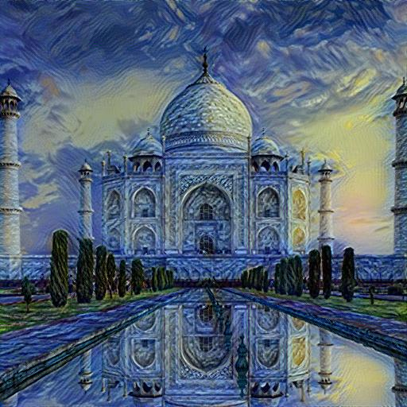

---

Here are a couple more examples:

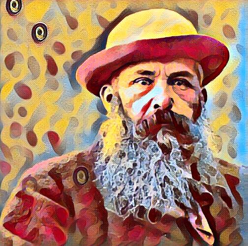
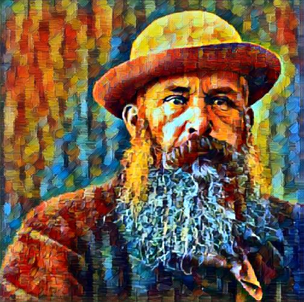
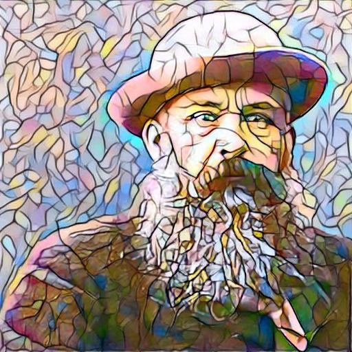

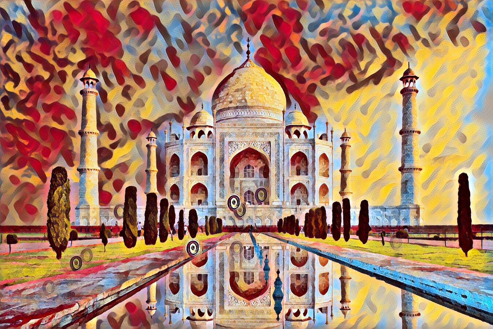
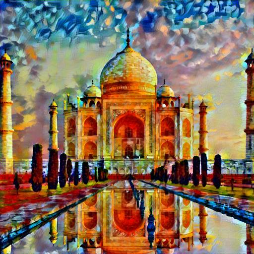
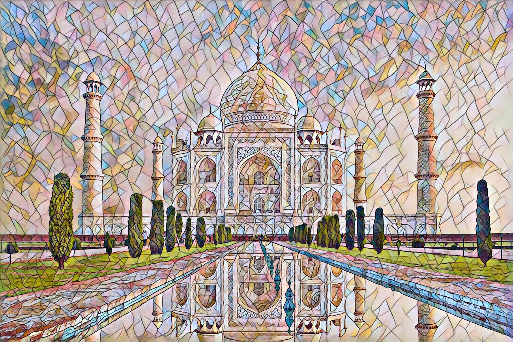

---

And here are some results coupled with their style:

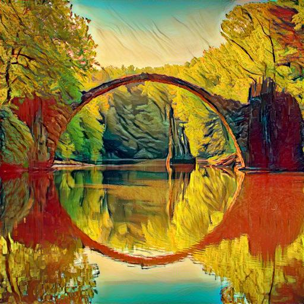

  
    
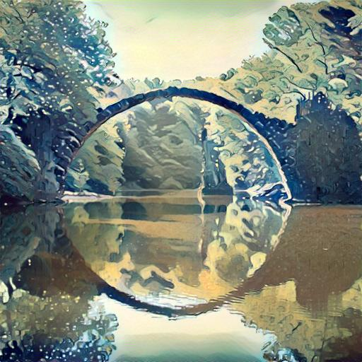

  

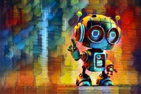

  

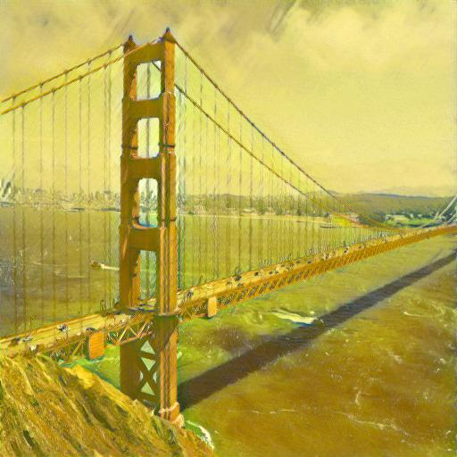

  

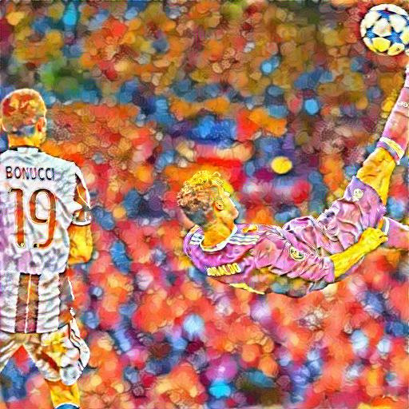

---

I have also optimized this naive implementation following [Perceptual Losses for Real-Time Style Transfer
and Super-Resolution](https://arxiv.org/pdf/1603.08155) by Johnson et al., achieving significantly faster inference which enables the algorithm to be applied to videos too!

    
    
    
      
    
    
    

